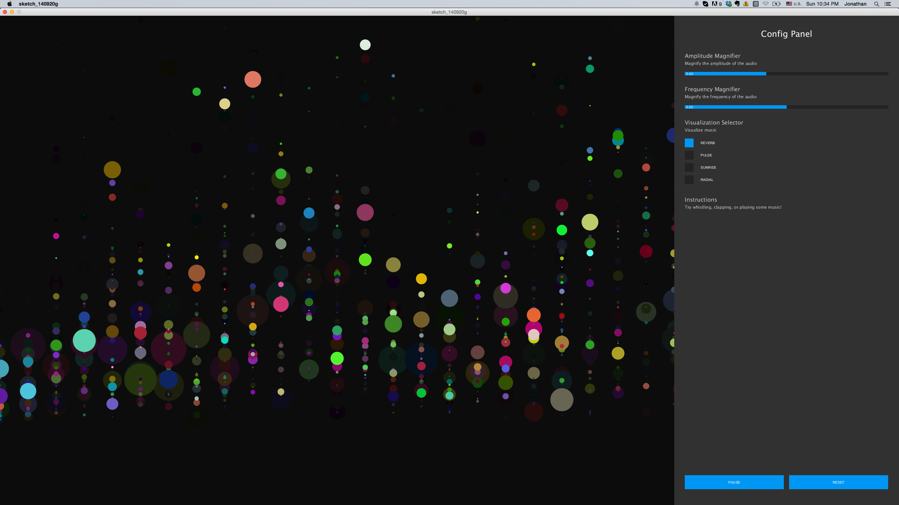
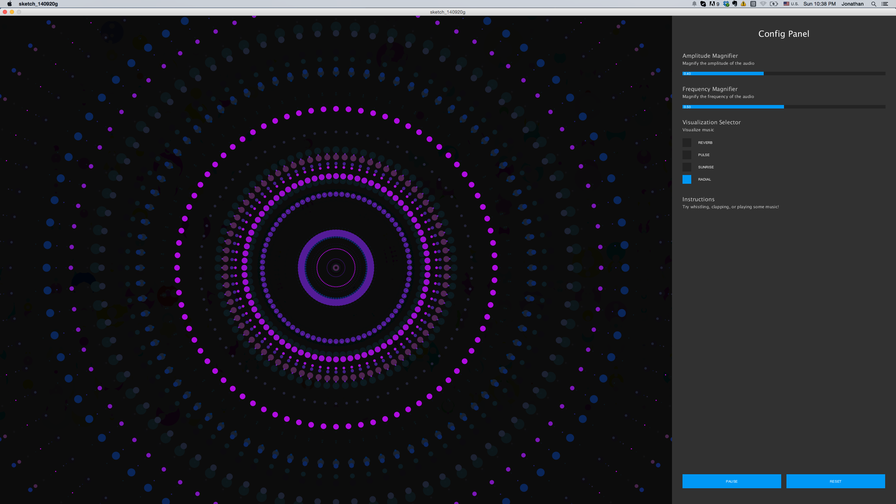

audio-visualizer
================

Processing program for visualizing music and sounds

#Github Repo
https://github.com/JonathanZWhite/audio-visualizer.git

#Installation
`$ git clone https://github.com/JonathanZWhite/audio-visualizer.git`

#Dependencies
[Processing - Processing is a programming language, development environment, and online community](http://www.processing.org/)

[ControlP5 Library - ControlP5 is a library written by Andreas Schlegel for the programming environment processing.](http://www.sojamo.de/libraries/controlP5/)

#Usage
Start by clapping or whistling into your computer's microphone - notice how the visualization react to the input? Next try playing some music. Instead of just playing music, try interacting with the program while music is playing and create visualizations based on more than just the music.

#Screenshots

#Troubleshooting
- If you the visualization is not working in the demo for PC users, try switching to either the 32 or 64 versions.
