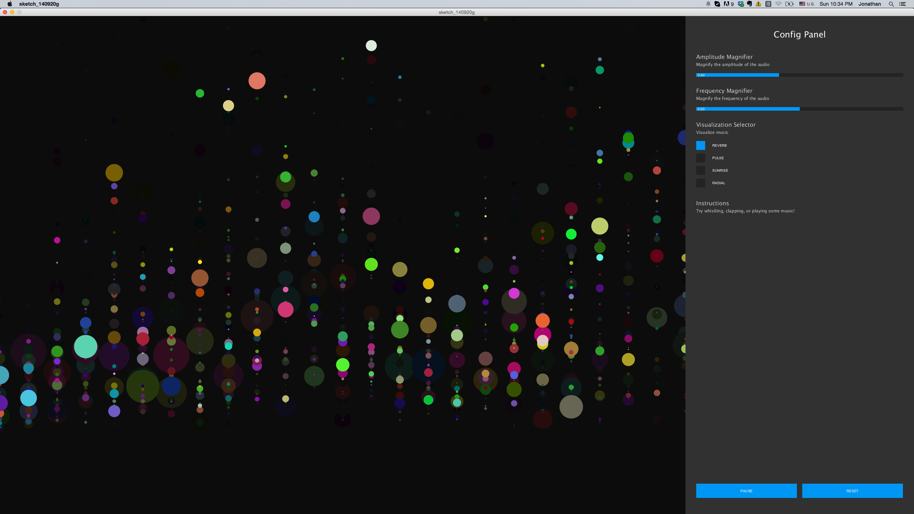
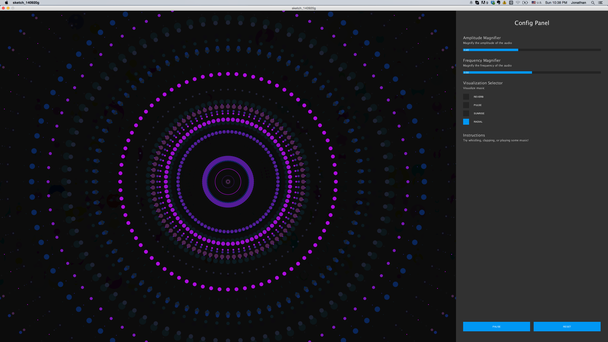

audio-visualizer
================

Processing program for visualizing music and sounds

#Installation
`$ git clone https://github.com/JonathanZWhite/audio-visualizer.git`

#Dependencies
In order to run this program in a processing environment, please download the ControlP5 library for added Processing GUI development utility.

[Processing - Processing is a programming language, development environment, and online community](http://www.processing.org/)

[ControlP5 Library - ControlP5 is a library written by Andreas Schlegel for the programming environment processing.](http://www.sojamo.de/libraries/controlP5/)

#Screenshots

